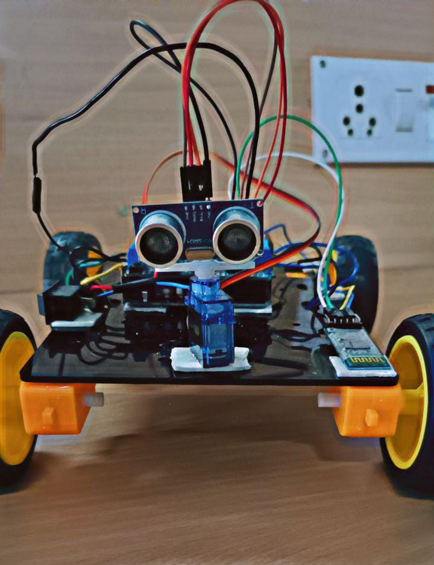

# 🚗 Intelligent Braking System – Prototype Project

An **Intelligent Braking System (IBS)** represents a significant advancement in automotive safety, combining sensors, control algorithms, and artificial intelligence to prevent accidents, reduce braking distances, and improve vehicle stability in emergency scenarios.

This project explores the design, functionality, and implementation of intelligent braking systems, demonstrating their impact on road safety and their integration with modern vehicle technologies.

---

## 📌 Abstract

The advancement of intelligent braking systems marks a critical milestone in automotive safety. This project explores systems such as:

- **Anti-lock Braking System (ABS)**
- **Electronic Stability Control (ESC)**
- **Autonomous Emergency Braking (AEB)**
- **Adaptive Cruise Control (ACC)**

These systems collectively enhance control, reduce accident risks, and ensure optimal braking in dynamic driving environments.

Intelligent braking systems use a combination of sensors, actuators, and decision-making algorithms to monitor road conditions, detect obstacles, and adapt braking responses. With the integration of **AI and machine learning**, these systems now offer predictive analysis and real-time safety interventions.

The project further investigates how V2V (Vehicle-to-Vehicle) and V2I (Vehicle-to-Infrastructure) communication can elevate braking performance and cooperative safety on smart roads.

---

## 🧪 Methodology

The development of this system followed a structured engineering approach:

### 1. 🗂️ Project Planning & Definition
- Defined key safety and technical objectives.
- Outlined the project scope, limitations, and milestones.
- Created a development roadmap.

### 2. 📚 Research & Requirements Gathering
- Studied existing braking technologies and safety standards.
- Identified functional and non-functional requirements including response time, sensor accuracy, and fail-safe mechanisms.

### 3. 🧩 System Design
- Designed the system architecture including:
  - Sensors (e.g., ultrasonic)
  - Microcontrollers or embedded platforms
  - Braking actuators
- Designed decision-making logic and AI-based prediction models.

### 4. 🛠️ Prototype Development
- Built a **hardware or software prototype** (depending on project scope).
- Integrated obstacle-detection sensors and braking mechanisms.
- Developed control algorithms for intelligent response.

### 5. ✅ Testing & Validation
- Conducted simulations under different terrain and obstacle conditions.
- Performed real-world testing in controlled environments.
- Validated against vehicle safety standards and benchmarks.

---

## 📸 Project Media

| Prototype Image |
|-----------------|
|  |

---

## 🚀 Outcomes

- Demonstrated enhanced vehicle safety in both simulated and controlled environments.
- Reduced stopping distances and improved system response in emergency situations.
- Laid the foundation for future integration with autonomous driving technologies.

---

## 🙋‍♂️ About the Author

Developed by **Vedururi Sreenivasulu**, a passionate engineer with a vision to enhance road safety through intelligent systems.  
GitHub: [vedururisreenivasulu](https://github.com/vedururisreenivasulu)

---

## 📬 Feedback & Support

Have suggestions or questions? Feel free to open an issue or start a discussion on the GitHub repository.

